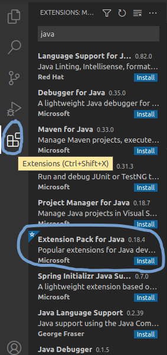
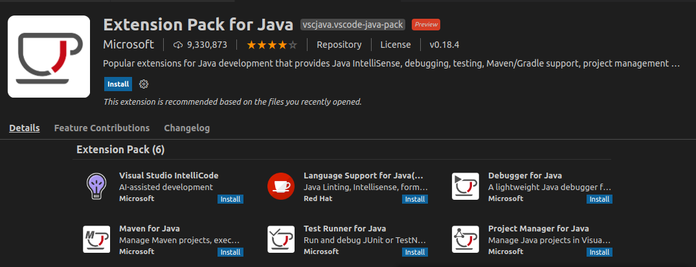
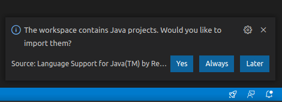
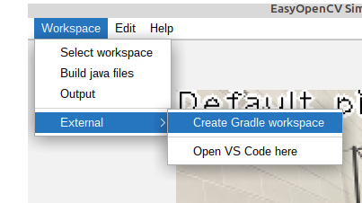
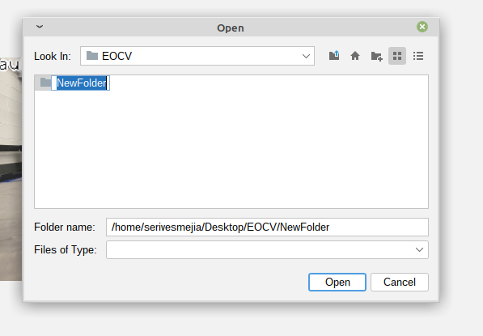

# VS Code and IntelliJ IDEA

Both IntelliJ IDEA and VS Code are the IDE and Text Editor recommended to use for EOCV-Sim. While IntelliJ is a fully featured IDE specifically designed for Java, with consistent and great autocompletion, refactoring features, etc, VS Code is more lightweight and faster in computers with limited resources.

This guide will explain how to use any of these two, you can choose whichever suits you the best.

## VS Code

**Make sure you installed a JDK as explained in the** [**Dowloading EOCV-Sim**](../basics/downloading-eocv-sim.md) **section.**

1. Download VS Code in [here](https://code.visualstudio.com) if you haven't already.

2. Open VS Code and install the [Extension Pack for Java](https://marketplace.visualstudio.com/items?itemName=vscjava.vscode-java-pack), going to the extensions section, search for "java" in the search box at the top and find the extension that looks like the following screenshot.





3. Click on the blue "Install" button and restart VS Code.

4. Do the steps specified in the [**Creating a Gradle workspace**](vscode-and-intellij.md#creating-a-gradle-workspace) section

5. Once you have done the steps in that section, go back to VS Code. If it wasn't  opened automatically by EOCV-Sim, open it manually and select the folder you created in EOCV-Sim.

6.  If the language support plugin asks to import the project on the botton right, click on yes.



7. Wait for the import process to finish, see a tiny loading icon in the bottom right.

8. Pop up the `src/main/java` folder. This is where you will put your pipelines.

9. To create a new pipeline, right click on the `java` folder and then "New File". Give the file a name and a `.java` extension \(append it at the end of the name, for example `GrayscalePipeline.java`\)

10. Copy paste this template to have a base to create your pipeline. Put the name of the class to the name you gave the file where it's indicated

```java
import org.opencv.core.Mat;
import org.opencv.imgproc.Imgproc;
import org.openftc.easyopencv.OpenCvPipeline;

public class <Name Here> extends OpenCvPipeline {

    @Override
    public Mat processFrame(Mat inputMat) {
        // Your code here
        return inputMat;
    }
    
}
```

If you have EOCV-Sim opened, every time you save the file in the editor \(you can use Ctrl + S\) a new build will be executed. If your pipeline was compiled sucessfully, it will be added to the list with a "gears" icon in the list to differentiate it.

But if the build failed, you will be presented with a output error message saying where the errors are located exactly. VS Code IntelliSense should help you finding these issues

Refer to the [pipelines section](../pipelines.md) if you wanna learn more about pipelines.

## IntelliJ IDEA

\(Work in progress\)

## Creating a Gradle workspace

1. Open EOCV-Sim \(follow [this page](../basics/downloading-eocv-sim.md#running-eocv-sim) if needed\)

2. In the top bar menu, go to **Workspace -&gt; External -&gt; Create Gradle Workspace**



3. In the file explorer, create a new empty folder or select one that already exists but has no files. You can't use a folder that already has files in it. Click on the folder icon with a + in the top, and give the new folder a name



4. Select the newly created folder and click on "open". 

It will pop up a dialog asking if you wanna open VS Code. If you were following the VS Code guide, click on "Yes" once it asks if you wanna open it, and go back to [step \#5](vscode-and-intellij.md#vs-code). 

If you were following the IntelliJ IDEA guide, click on "No" and go back to \*.

